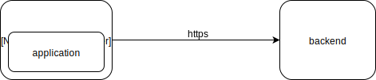

A first step to debugging usually is logging. The same is true for network connections. But eavesdropping is exactly what HTTPS/SSL/TLS is supposed to prevent. Let's have a closer look if and how you debug your secured connections.

## The Web Scenario

The HTTPS connection is kind of like a tunnel. On both ends you can see what goes in and what comes out. At one of these ends is the browser. It has full access to all the content. This is why, if you are debugging a web application, a browser extension is probably the best, or at least the easiest choice.

For both, [Chrome](https://chrome.google.com/webstore/detail/live-http-headers/ianhploojoffmpcpilhgpacbeaifanid) and [Firefox](https://addons.mozilla.org/en-US/firefox/addon/http-header-live/), extensions are available that allow you to inspect the communication beyond what is already available through the built-in developer tools.

## The Mobile App Scenario

If a browser extension is not feasible there isn't much of a choice but to interrupt the tunnel. You basically need to split the tunnel into two to get another point that allows incepting the communication. This is usually what is referred to as a "man in the middle".

By telling the OS to connect through a proxy, the proxy can split the tunnel. It can terminate the HTTPS connection and pretend to be the origin server. But this won't go unnoticed. Unless - the new server can generate a fake certificate that is trusted. For the certificate to be trusted is has to be signed by one of the CAs that are considered trusted by the OS. This is quite unlikely to happen. But the proxy can use its own CA. By telling the OS to trust that CA, the generated fake certificate can pass as the real deal. And that's basically how all the following tools work.

||Mac|Linux|Windows|Price|
|---|:-:|:-:|:-:|:--|
|[Charles](https://www.charlesproxy.com/)|y|y|y|~50 USD|
|[Fiddler Everywhere](https://www.telerik.com/fiddler)|y|y|y|free or subscription|
|[mitmproxy](https://mitmproxy.org/)|y|y|y (WSL)|free|

If you need to dig one level deeper, there is also [SSLsplit](https://github.com/droe/sslsplit). It supports not only HTTPS, but any SSL TCP connection.

I am a happy [Charles](https://www.charlesproxy.com/) customer for many years.

## Certificate Pinning

As shown above, with HTTPS it is all a matter of who you trust. To fully prevent this kind of eavesdropping some software uses certificate pinning. By checking the fingerprints of the certificate chain, switching the certifacte and even using a custum CA does not go unnoticed.
