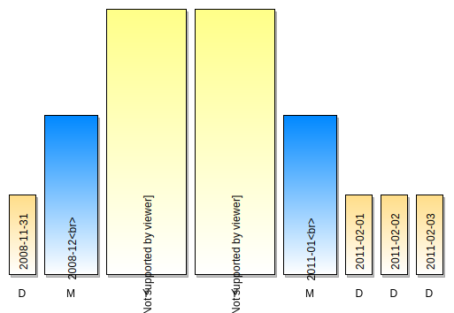
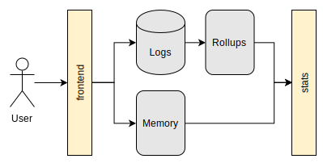

Many sites provide statistics for their users' contents. And many of them provide a graph of how many events (plays/views/visits) the content got over time.

This is easy when aggregating over the raw events data. But that's neither particularly fast nor scalable. As soon as the number of events or the time window gets too big this approach is no longer feasible.

A natural choice is to rollup the data into time buckets. By creating counters per different time units, the number of operations can be kept at a minimum and still provide fast aggregation over large time windows. The time needed then no longer depends on the actual number of events.

Calculating the aggregate then becomes as simple as adding a couple of counters. It's the sum of the most covering aggregates that fit into the given time interval.

Getting the total count for the interval from 2008-11-31 until 2011-02-03 means getting 8 values and adding them.

Choosing the time units here defines the read pattern and the number of counters needed. A natural combination of bucket units would, of course, be *year+month+day* but *year+week+day* could be an option, too. Even just rolling up the counts into *day* buckets could make sense. The icing on the cake is when the units can be kept abstracted enough and switching between models is possible without bigger efforts.

But for an informed decision, it's best to check against real user request and to calculate the required storage needs.

## Rollups with Map Reduce

While the read path should be clear the events still need to be rolled up. A naive approach is to increments counters while they arrive. A fan-out where a single event causes multiple increment operations

    event at 2011-03-14 =>
      2011 += 1
      2011-03 += 1
      2011-03-14 += 1

This puts a lot of write pressure on the store. Of course, an increment is not just a write but also a read. And on top of that of all that these increments should happen in a single transaction. And this still doesn't account for the read load.

Another option is to generate the counters from log files. Which could be implemented with a simple map-reduce job. The mapper emits the data for the track and/or global counters.

    func mapper(lines [][]string) [][]string {
      var result [][]string
      for _, line := range lines {
        date := line[0]
        track := line[1]

        // per track counters
        result = append(result, []string{track, date})

        // global counters (if needed)
        result = append(result, []string{"*", date})
      }
      return result
    }

Next, the data gets sorted. A distributed setup also needs a partitioner to split the data up per *track+year*. This guarantees that a single reducer sees the data of a full year per track. Otherwise, I could not calculate the full rollup per year.

The reducer is simple but the real workhorse. It detects changes in the incoming data, does the rollups and emits the final counts.

    func reducer(lines [][]string) {

      counter_d := 1
      counter_m := 1
      counter_y := 1

      prev_d := ""
      prev_m := ""
      prev_y := ""
      prev_t := ""

      for i, line := range lines {

        date := line[1]
        d := date[0:10]
        m := date[0:7]
        y := date[0:4]
        t := line[0]

        if i != 0 {

          if d != prev_d {
            write(prev_t, prev_d, counter_d)
            counter_d = 1
          } else {
            counter_d += 1
          }

          if m != prev_m {
            write(prev_t, prev_m, counter_m)
            counter_m = 1
          } else {
            counter_m += 1
          }

          if y != prev_y {
            write(prev_t, prev_y, counter_y)
            counter_y = 1
          } else {
            counter_y += 1
          }

          if t != prev_t {
            counter_d = 1
            counter_m = 1
            counter_y = 1
          }
        }

        prev_d = d
        prev_m = m
        prev_y = y
        prev_t = t
      }

      if prev_t != "" {
        write(prev_t, prev_d, counter_d)
        write(prev_t, prev_m, counter_m)
        write(prev_t, prev_y, counter_y)
      }
    }

Ideally, this job will create the data that is ready for a bulk import into a fast store that can then serve the web requests in a timely manner.

The code is just for demonstration purposed and not suited for real-world usage. But here is [the full code][5] in [a playground][1] to see the example in action.

<aside>

If the presented approach is being used for global counters it means that all the events of a *full* year need to pass through a *single* reducer - a *single* machine. This presents a hard limit in processing time that will also not decrease by growing the cluster. To eliminate the hard limit and thereby improve the scalability the partitioner approach is not acceptable. Instead, it needs a secondary job to combine the rollups. In the end, this is just a batch job - so it really depends on the exact use case whether the added complexity is really needed or not.
</aside>

## From Batch to Real Time

Calculating the rollups purely in a batch job creates a lag. Whether that is acceptable or not depends on the use case but often enough real time stats are now the requirement.

With a hybrid approach, a [lambda architecture][2] can close the gap from batch to real-time. The batch layer provides the rollups up until a certain point in time. Everything past is served from a fast in-memory layer.

The in-memory layer can even be transient as the eventual source of truth will always be the batch layer. A [similar architecture][3] is serving the play count statistics at [SoundCloud][4].

[1]: https://go.dev/play/p/PTV7ee2frlM
[2]: https://en.wikipedia.org/wiki/Lambda_architecture
[3]: https://developers.soundcloud.com/blog/keeping-counts-in-sync/
[4]: https://soundcloud.com/
[5]: timeseries.go
