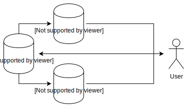

Scaling out a database usually means creating a master-slave setup where the slaves replicate information from the master. This naturally creates a replication lag. Depending on the load of the systems the slaves will be behind master anything between seconds, minutes or even more.

This lag creates problems in the application tier. In the above figure, only one of the slaves has caught up with the replication. Picking the wrong slave when reading can return outdated data.

When data consistency in the user interaction is required applications usually fall back to the master. When the user changes a setting the subsequent request should not show stale data from a slave that is not up to speed yet.

For Rails, multiple master-slave adapters are available that act as transparent delegates to connect to the master-slave setup. By wrapping the database access *ActiveRecord* can be forced to go to the master when full consistency for the user interaction is required.

    ActiveRecord::Base.with_master do
      ...
    end

But this can lead to many more requests to the master than what is really needed. Taking a step back what really is required most of the time is just a per-user consistency.

> Users should immediatly see what they changed - not necessarily what other users have changed.

This loosens the contract and is the basis for an idea.

The master server has a binlog position that increases with every write. Slaves are fully replicated when their binlog position matches the one from master. It's a race of an ever-increasing clock.

This means that if the clock on the slave matches (or is larger than) the clock of the last write of the user, the query can safely use the slave without risking inconsistencies to be presented to the user.

To express this contract we introduced a new construct into the adapter

    new_clock = ActiveRecord::Base.with_consistency(old_clock) do
      ...
    end

Whenever there is a write the clock is increased. The *with_consistency* is a contract that the block is executed on a database that has reached the given clock. When entering such a block the master-slave adapter checks the slave replication status and makes the right choice whether the query can be served from the slave or whether it requires to go to the master. It shaves off all the unnecessary read requests to the master.

> Focus on the user's view of the database.

By introducing this change at [SoundCloud][1] we managed to reduce the query load on the master server by roughly 50% and made better use of our slaves. The master no longer is the bottleneck. The per-user clocks are stored in memcache. If the user does not have a clock yet we fall back to master.

The fork of the master-slave adapter is [available on github][2] and can be used from Rails as a gem.

    gem install master_slave_adapter

It is in production since June and we are more than happy with the results so far. If you have Rails and a MySQL cluster you should probably give it a try.

<aside>

Because it makes use of `SHOW MASTER STATUS` and `SHOW SLAVE STATUS` it's available to MySQL only for now. It certainly should work for any other database that allows access to the binlog position via SQL.
</aside>

[1]: https://soundcloud.com
[2]: https://github.com/soundcloud/master_slave_adapter
