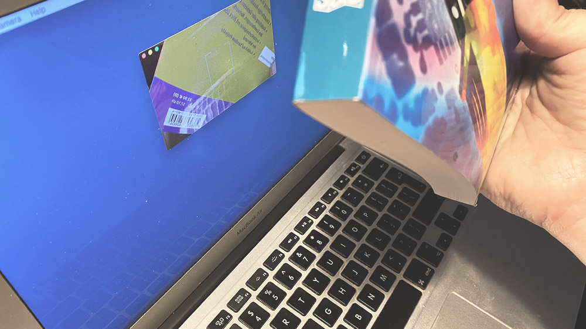

Shell scripts and Automator workflows are powerful tools to build automation setups on Mac. Unfortunately, neither allows for interfacing with QR or barcodes easily.

While there are plenty of tools to generated QR and barcodes, the options for scanning them from the built-in camera are scarce. Let alone connecting the reading process to scripting.

I wrote a little tool called [ScanCode][1] that acts as an input for shell scripts and Automator workflows. This lets you easily read barcodes and transform their data however you like.

While scanning all your books to a CSV file is a possible and easy use case, let me walk you through a slightly more complex application that helps with SEPA transfers.

## SEPA Transfers

More and more often you see QR codes printed on invoices. They contain the data for the transfer. No typing, and more importantly, no typing errors when copying that long IBAN into your banking software.

Some banking software allows for directly scanning the QR code. While [MoneyMoney](https://moneymoney-app.com/) (the banking software of my choice) does not support direct scanning, it does support a URL schemes for starting a new SEPA transfer. So all is needed is to transform the scanned QR code data into a conforming URL and then open MoneyMoney with that URL.

### EPC

Probably the most widely used standard to encode payment information in QR codes is [EPC code][1] - at least in the EU. To this date, there is adoption in Austria, Belgium, Finland, The Netherlands, and Germany.

The EPC is a lines based encoding of the SEPA transfer information. The [documentation](https://www.europeanpaymentscouncil.eu/sites/default/files/KB/files/EPC069-12%20v2.1%20Quick%20Response%20Code%20-%20Guidelines%20to%20Enable%20the%20Data%20Capture%20for%20the%20Initiation%20of%20a%20SCT.pdf) is available from the European Payments Council. Here is an example:

    BCD
    002
    1
    SCT
    RLNWATWW
    Doctors Without Borders
    AT973200000000518548
    EUR1500.99

    Emergency Donation

An [online generator](https://qrcode.tec-it.com/en/SEPA) is available, too.

### URL schemes

MoneyMoney supports two URL schemes:

    bank://
    payto://

The *Bezahlcode* was a specification written by a German company. It used a rather flexible URI scheme to encode the payment information.

    bank://singlepaymentsepa?name={NAME}&reason={REASON}&iban={IBAN}&amount={AMOUNT}

The most import fields are `name`, `reason`, `iban` and `amount`. Unfortunately, the official documentation is no longer online. But fortunately enough the usage is simple and it still is a supported interface to pass information into MoneyMoney.

The `payto` scheme is defined in [RFC 8905](https://www.rfc-editor.org/rfc/rfc8905) and uses a very similar approach:

    payto://iban/{IBAN}?amount=EUR:{AMOUNT}&message={MESSAGE}

It uses very similar input fields. The `message` field is the equivalent of `reason` in `Bezahlcode`.

### Developing the Script

A simple script helps to store the QR code data in a file. This allows for a much faster development cycle.

    #!/bin/sh
    cat > $HOME/Desktop/code.txt

First open the image of the [Bezahlcode](bezahlcode.png) on the phone, scan, and rename. Next open the image of the [EPC code](epc.png) on the phone, scan, and rename. Now we can pipe those files into the target script.

    cat bezahlcode.txt | ./bezahlcode.sh
    cat epc.txt | ./bezahlcode.sh

Both executions should open as a SEPA transfer in MoneyMoney. Let's write the `bezahlcode.sh` script.

First, we turn the lines that come in via `stdin` into an array for easier access.

    unset lines
    while IFS= read -r; do
      lines+=("$REPLY")
    done
    [[ $REPLY ]] && lines+=("$REPLY")

While there is a much shorter and nicer version for the above shell code, this one also handles empty lines correctly.

Now we need to check with what type of code we are dealing with.

    if [ "${lines[0]:0:25}" = "bank://singlepaymentsepa?" ]; then
      open "${lines[0]}"
      exit 0
    fi

For Bezahlcode there is nothing to be done. We can just pass the URL as is. For EPC it's a bit more work. We need to extract, adjust some and urlencode all data before we create the final URL.

    if [ "${lines[0]}" = "BCD" ]; then
      BIC=`echo ${lines[4]} | urlencode`
      NAME=`echo ${lines[5]} | urlencode`
      IBAN=`echo ${lines[6]} | urlencode`
      AMOUNT=`echo ${lines[7]} | tr -cd "[:digit:] [:punct:]" | urlencode`
      REASON=`echo ${lines[10]} | urlencode`

      open "bank://singlepaymentsepa?name=${NAME}&iban=${IBAN}&bic=${BIC}&amount=${AMOUNT}&reason=${REASON}"
      exit 0
    fi

That's it. Here is a link to [download the full script](bezahlcode.sh). It includes the `urlencode` function that I left out above for brevity. Just put the `bezahlcode.sh` script into the ScanCode script folder, make sure permissions allow for execution and you are good to go.

The script is now also included with ScanCode inside the example folder.

[1]: https://en.wikipedia.org/wiki/EPC_QR_code
